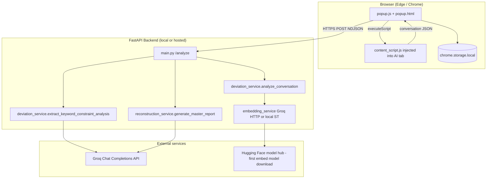

# Model Deviation Summarizer — Architecture & Technical Reference

This document describes the **Model Deviation Summarizer** project: the Microsoft Edge / Chromium extension, the FastAPI analysis backend, data flows, configuration, and how the pieces fit together.

---

## 1. Purpose (Product)

The product helps users **inspect AI chat threads** (ChatGPT, Gemini, Claude, Perplexity, DeepSeek) for **alignment drift** between what the user asked and how the model replied. It produces a **structured diagnostic-style report** and a **reconstructed “expert” prompt**, grounded in:

- **Deterministic metrics** (embeddings, cosine similarity per turn, keyword overlap, drift heuristics)
- **Two Groq LLM calls** on the backend: (1) JSON extraction of keywords/constraints/intent, (2) final master report from a fixed prompt template

The user supplies a **Groq API key** (stored in the browser; also sent to the backend with each analysis request so the server can call Groq).

---

## 2. Repository Layout

| Path | Role |
|------|------|
| `main.py` | **Primary FastAPI app**: `/analyze` (streaming NDJSON), `/test-groq`, `/test-ollama`, `/chat`, health routes |
| `models.py` | Pydantic `ChatRequest`, `Message`, `IntegratedResponse`; `get_runtime_config()` for Groq/model/domain/language |
| `config.py` | Loads `.env`: `GROQ_API_KEY`, `GROQ_MODEL`, `DOMAIN`, `SUPPORTED_LANGUAGES`, `EMBED_MODEL` |
| `groq_client.py` | Factory: `get_groq_client`, `get_groq_model`, `get_domain` (request overrides `.env`) |
| `embedding_service.py` | Default **Groq HTTP embeddings** (`nomic-embed-text-v1.5`); optional **local** path via `embedding_local.py` + `sentence-transformers` |
| `embedding_local.py` | Optional SentenceTransformers path when `EMBEDDING_PROVIDER=local` |
| `deviation_service.py` | `analyze_conversation` (embedding metrics, drift heuristics) + `extract_keyword_constraint_analysis` (Groq JSON extraction) |
| `reconstruction_service.py` | `MASTER_PROMPT`, `DOMAIN_PERSONAS`, `generate_master_report` (second Groq call) |
| `summary_service.py` | `build_conversation_text`, `detect_language`, `LANGUAGE_NAMES`, `summarize_transcript` (Groq summarization — **not used** by `main.py` analyze pipeline today) |
| `extension/` | MV3 extension: `manifest.json`, `popup.html` / `popup.js`, `content_script.js`, `style.css`, `ICON.png` |
| `pipeline_core.py` | Shared `build_master_payload()` used by `main.py` and `main_appwrite.py` |
| `extension/appwrite.js` | Large **Appwrite client SDK** bundle (optional / alternate backend integration) |
| `main_appwrite.py` | **Appwrite Function** entrypoint; same analysis stages as `/analyze` (non-streaming JSON) |
| `requirements.txt` | Python dependencies including `sentence-transformers` (pulls PyTorch and related stacks) |

---

## 3. High-Level Architecture



**Default shipping configuration:** the extension’s `manifest.json` declares `host_permissions` for `https://model-deviation-summarizer.onrender.com/*` and `popup.js` posts to that origin. **Self-hosted** use requires changing the extension URL and manifest host permissions to your API base (e.g. `http://127.0.0.1:8000`).

---

## 4. Extension (MV3)

### 4.1 Manifest (`extension/manifest.json`)

- **Manifest version:** 3  
- **Permissions:** `activeTab`, `scripting`, `storage`  
- **Host permissions:** Render API host + supported AI chat origins (ChatGPT, Gemini, Perplexity, Claude, DeepSeek).  
- **Action:** popup UI for onboarding + analysis.

### 4.2 Popup (`popup.js` / `popup.html`)

**Storage keys (chrome.storage.local):**

| Key | Meaning |
|-----|---------|
| `groqApiKey` | User’s Groq API key |
| `groqModel` | Selected model id (e.g. `llama-3.3-70b-versatile`) |
| `domain` | UI domain preset |
| `language` | `auto` / `en` / `ta` / `hi` |
| `onboarded` | Wizard completed flag |

**Flow:**

1. **Wizard:** Step 1 tests Groq via `POST …/test-groq` with **`Authorization: Bearer`** (or JSON `api_key`). Step 2 saves model. Step 3 is **disclosure** (“how analysis works”).  
2. **Main:** User selects domain/language, opens a supported AI tab, clicks **Analyze Active Tab**.  
3. **Scrape:** `chrome.scripting.executeScript` injects `content_script.js` into the **active tab**; returns `{ conversation: [{ role, content }, …] }` or `{ error }`.  
4. **Analyze:** `POST …/analyze` with JSON body: `conversation`, `domain`, `language`, `llm_type`, `model`, optional `embedding_provider` / `embedding_model`, plus **`Authorization: Bearer`** for the Groq key (preferred over `api_key` in body).  
5. **Response:** NDJSON lines; client parses JSON per line, updates status from `chunk.status`, final text from `chunk.final_output`, errors from `chunk.error`.

### 4.3 Content script (`extension/content_script.js`)

- Runs as an **IIFE**; returns a single object to `executeScript`.  
- **Hostname → scraper** map: `chatgpt.com`, `gemini.google.com`, `perplexity.ai`, `claude.ai`, `deepseek.com`.  
- Each scraper walks DOM selectors (fragile by nature — **breaks if host sites change markup**).  
- Normalized roles: `user` vs `model` (ChatGPT “assistant” mapped to `model`).

---

## 5. Backend (FastAPI) — Core Pipeline

### 5.1 Endpoint: `POST /analyze`

**Request body:** `ChatRequest` (`models.py`)

- `conversation`: list of `{ role, content }`  
- `domain`, `language`, `embedding_model` (default `all-MiniLM-L6-v2`)  
- `api_key` (or Bearer header), `model` — forwarded into `get_runtime_config()` for Groq chat + embeddings

**Response:** `StreamingResponse`, **media type** `application/x-ndjson` (newline-delimited JSON).

**Streaming stages** (`main.py` → `analyze_stream`):

| Order | Status message (example) | Work |
|------|---------------------------|------|
| 1 | Embedding & computing alignment metrics… | `analyze_conversation` in a thread |
| 2 | Extracting keywords, constraints & intent… | `build_conversation_text` + `extract_keyword_constraint_analysis` in a thread |
| 3 | Building structured deviation payload… | Assemble `master_payload` dict |
| 4 | Generating Master Diagnostic Report… | `generate_master_report` in a thread |
| Final | — | One line with `{ "final_output": "<markdown report>" }` |

On exception: yields `{ "error": "<message>" }`.

### 5.2 Embedding path (`embedding_service.py`)

- **Default (`EMBEDDING_PROVIDER=groq`):** `POST https://api.groq.com/openai/v1/embeddings` with model `nomic-embed-text-v1.5` (or `GROQ_EMBED_MODEL`), batched (chunk size capped in code). Requires Groq API key (from request or env).  
- **Local (`EMBEDDING_PROVIDER=local`):** `embedding_local.embed_texts_local` using SentenceTransformers (`EMBED_MODEL`, default `all-MiniLM-L6-v2`); install optional deps from `requirements-local-embed.txt`.  
- **`cosine_similarity`:** pure-Python L2-normalized dot product (works for Groq and ST vectors).

### 5.3 Deviation metrics (`deviation_service.py` — `analyze_conversation`)

For each adjacent **user** / **assistant|model** pair:

1. `embed_texts([user_text, asst_text])`  
2. `cosine_similarity` → `semantic_alignment`  
3. `_keyword_overlap` on token sets (Latin + Indic regex ranges)  
4. Builds `turns`, `sentence_alignment[]`, aggregate averages  
5. **Drift heuristic:** first index where `avg_alignment - score > 0.15` → `drift_point` (or `"none"`)  
6. **Severity** from average alignment thresholds (`<0.5` high, `<0.75` moderate, else low)

Returns: `conversation_metrics`, `sentence_alignment`, `drift_analysis`, `aggregate`.

### 5.4 First LLM pass (`extract_keyword_constraint_analysis`)

- Single Groq chat completion, **temperature 0.1**, system prompt demands **strict JSON** with keys: `original_query`, `model_response`, `intent_alignment`, `constraint_score`, `keyword_analysis`, `constraint_analysis`.  
- Parsed with `json.loads`; on failure returns `{}`.

### 5.5 Master report (`reconstruction_service.py` — `generate_master_report`)

- Builds `system_prompt` = domain **persona** + `MASTER_PROMPT` + `MULTILANG_INSTRUCTION`.  
- **Domains with explicit personas in code:** `education`, `healthcare`, `banking` only. The extension UI also lists **legal** and **engineering** — those fall back to the education persona string in `DOMAIN_PERSONAS.get(domain, …)` (same default block as education’s key missing).  
- User message = `INPUT:` + pretty-printed JSON payload.  
- Groq call **temperature 0.3**, `max_tokens=2000`.  
- Output is markdown sections: Deviation Summary, Root Cause, Drift Location, Evidence, Misunderstanding, Fix Strategy, Reconstructed Expert Prompt.

### 5.6 Other HTTP routes (`main.py`)

| Route | Purpose |
|-------|---------|
| `GET /` | Health JSON |
| `GET /config` | Non-secret config snapshot |
| `POST /test-groq` | Validates Groq key; returns model id |
| `GET /test-ollama` | Probes `127.0.0.1:11434` for Ollama tags — **orthogonal** to embedding_service (no Ollama in embed path) |
| `POST /chat` | Standalone domain chat assistant (persona + multilingual reply); **separate** from `/analyze` |

---

## 6. Configuration & Environment

| Variable | Typical use |
|----------|----------------|
| `GROQ_API_KEY` | Server-side default if extension does not send a key |
| `GROQ_MODEL` | Default chat model if extension does not send `model` |
| `DOMAIN` | Default domain |
| `DEFAULT_LANGUAGE` | Default language code |
| `EMBEDDING_PROVIDER` | `groq` (default) or `local` |
| `GROQ_EMBED_MODEL` | Groq embedding model id (default `nomic-embed-text-v1.5`) |
| `EMBED_MODEL` | Local SentenceTransformer name when `EMBEDDING_PROVIDER=local` |

`.env` is gitignored; use `.env.example` as a template.

---

## 7. Security, Privacy, and Operational Notes

1. **Conversation content** leaves the browser to the **configured API origin** (Render by default).  
2. **Groq API key** is stored in `chrome.storage.local` and sent to your backend in the **`Authorization: Bearer`** header (extension); the server uses it for Groq **chat** and **embedding** HTTP calls. Treat the backend as **trusted** or self-host.  
3. **CORS** allows `chrome-extension://…`, `localhost`, and the Render host (not `*`).  
4. **DOM scraping** is best-effort; unsupported or restyled pages may return empty or wrong `conversation`.  
5. **Local embeddings** (`EMBEDDING_PROVIDER=local`) pull **PyTorch** / `sentence-transformers`; the default **Groq** embedding path does not.

---

## 8. Deployment Modes

| Mode | Extension target | Backend |
|------|------------------|---------|
| **Production (default package)** | `https://model-deviation-summarizer.onrender.com` | Hosted FastAPI + same deps |
| **Local dev** | Change `popup.js` fetch URLs + `manifest.json` `host_permissions` for `http://127.0.0.1:8000` | `uvicorn main:app --reload` from repo root |
| **Appwrite** | Extension or server calls Appwrite function | `main_appwrite.py` — aligned with FastAPI pipeline; deploy with Python runtime + optional `GROQ_API_KEY` in env |

---

## 9. Dependency Graph (Logical)

```
main.py
├── models.ChatRequest
├── deviation_service.analyze_conversation
│     └── embedding_service.embed_texts / cosine_similarity
├── deviation_service.extract_keyword_constraint_analysis
│     └── groq_client
├── summary_service.build_conversation_text
├── reconstruction_service.generate_master_report
│     └── groq_client
└── groq_client → config
```

`summary_service.summarize_transcript` is **not** referenced by `main.py` today; it remains available for other entrypoints or future use.

---

## 10. Extension ↔ Backend Contract

**Minimal successful scrape result:**

```json
{ "conversation": [ { "role": "user", "content": "..." }, { "role": "model", "content": "..." } ] }
```

**Analyze payload (conceptual):** conversation array plus `domain`, `language`, `model`, optional `embedding_provider` / `embedding_model`, and **`Authorization: Bearer <groq_key>`** (or legacy `api_key` in JSON).

**NDJSON line types:**

- `{ "status": "..." }` — progress  
- `{ "final_output": "..." }` — success body  
- `{ "error": "..." }` — failure  

---

## 11. Maintenance & Known Gaps

1. **`/test-ollama`** and copy about Ollama are **misleading** if presented as required for embeddings when using SentenceTransformers.  
2. **Scrapers** require ongoing updates when third-party UIs change.  
3. When changing `/analyze` stages, update **`pipeline_core.py`** and **`main_appwrite.py`** together (or extend shared helpers).

---

## 12. How to Run (Quick Reference)

**Backend:**

```bash
python -m venv venv
# Windows: venv\Scripts\activate
pip install -r requirements.txt
uvicorn main:app --reload --host 127.0.0.1 --port 8000
```

**Extension:** Edge → `edge://extensions` → Load unpacked → select `extension/` directory. Point the extension at your API if not using the default Render URL.

---

*Document generated to reflect the codebase structure and behavior; update this file when you change pipelines, personas, or extension–backend contracts.*
