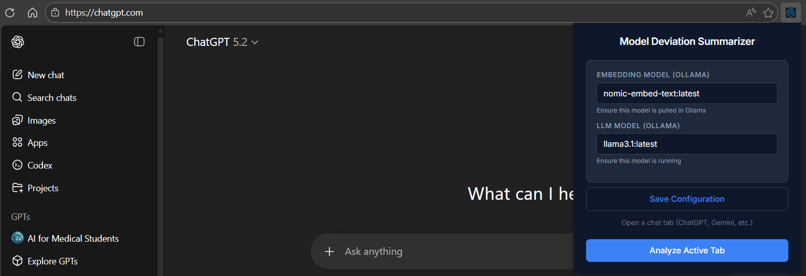

<div align="center">
  
  <h1>Model Deviation Summarizer</h1>
</div>

**Model Deviation Summarizer** is an Edge extension designed to analyze conversations with AI models (ChatGPT, Gemini, Claude, Perplexity) and detect deviations from your original intent. It uses the Groq API for fast analysis and reconstruction, identifies shifts in context or tone, and generates a highly optimized "Expert Prompt" to help you get back on track.



## Features

-   **Groq-Powered Analysis**: Uses Groq API for low-latency LLM inference.
-   **Deviation Analysis**: Detects when and how an AI model drifted from your original request.
-   **Vector-Based Metrics**: Calculates semantic alignment scores using sentence-transformers embeddings.
-   **Expert Prompt Reconstruction**: Automatically generates a refined, improved prompt based on the analysis to fix the deviation in a new session.
-   **Multilingual Support**: English, Tamil, and Hindi with automatic language detection.
-   **Multi-Platform Support**: Works on:
    -   ChatGPT
    -   Google Gemini
    -   Claude.ai
    -   Perplexity.ai
-   **Professional UI**: Clean, dark-themed interface for distraction-free analysis.

## Prerequisites

1. **Python 3.9+**
2. **Groq API Key** - free at [console.groq.com](https://console.groq.com)
   - No Ollama or local GPU required
3. **Google Chrome or Microsoft Edge**

## Quick Start

```bash
pip install -r requirements.txt
cp .env.example .env
uvicorn main:app --reload
```

Then load the `extension/` folder as an unpacked extension, choose your domain/language in the popup, and click **Analyze Active Tab**.

## Installation

### 1. Clone the Repository
```bash
git clone https://github.com/sanjeev1508/Model-Deviation-Summarizer.git
cd Model-Deviation-Summarizer/app
```

### 2. Setup Backend
Create a virtual environment and install dependencies:
```bash
python -m venv venv
# Windows
venv\Scripts\activate
# Mac/Linux
source venv/bin/activate

pip install -r requirements.txt
```
Configure `.env` from `.env.example` and set:

```env
GROQ_API_KEY=your_key_here
GROQ_MODEL=llama-3.3-70b-versatile
```

### 3. Load Extension
1.  Open Chrome/Edge and navigate to `chrome://extensions`.
2.  Enable **Developer Mode** (top right).
3.  Click **Load unpacked**.
4.  Select the `extension` folder inside the `app` directory.

## Usage

1.  **Start the Backend**:
    ```bash
    uvicorn main:app --reload
    ```
    The backend will run at `http://127.0.0.1:8000`.

2.  **Open a Chat**:
    Go to ChatGPT, Gemini, or Perplexity and have a conversation.

3.  **Analyze**:
    -   Click the extension icon.
    -   Configure domain/language only (API key + model come from backend `.env`).
    -   Optional: click **Test Connection** to verify backend + Groq config.
    -   Click **Analyze Active Tab**.
    -   Wait for the "Comprehensive Deviation Report".

## Runtime Configuration

The project is now configured to use a single Groq provider path:

- `GROQ_API_KEY` from backend `.env`
- `GROQ_MODEL=llama-3.3-70b-versatile`
- Domain options: `education`, `healthcare`, `banking`
- Languages: auto-detect or fixed `en`, `ta`, `hi`

The extension no longer sends API key or model to the backend.

## Project Structure

```
app/
├── extension/          # Browser extension source (manifest, popup, content script)
├── main.py             # FastAPI backend entry point
├── deviation_service.py # Core logic for embeddings & vector analysis
├── summary_service.py   # Transcript summarization logic
├── reconstruction_service.py # Prompt optimization logic
├── models.py           # Pydantic data models
└── requirements.txt    # Python dependencies
```

## Domain-Specific Multilingual GPT

The `/chat` endpoint acts as a domain-aware GPT that supports:

| Domain      | Persona                                  |
|-------------|------------------------------------------|
| Education   | Educational consultant & curriculum designer |
| Healthcare  | Senior medical advisor                   |
| Banking     | Financial advisor & compliance expert    |

**Supported Languages**: English · தமிழ் (Tamil) · हिन्दी (Hindi)

Language is auto-detected from user input. You can also pin a language in the extension settings.

## Privacy

This tool extracts chat data in your browser extension and sends it to your backend (`localhost:8000`), which then calls Groq API for model inference. Store API keys securely and avoid sharing sensitive transcripts.

## Contributing

Contributions are welcome! Please feel free to submit a Pull Request.
